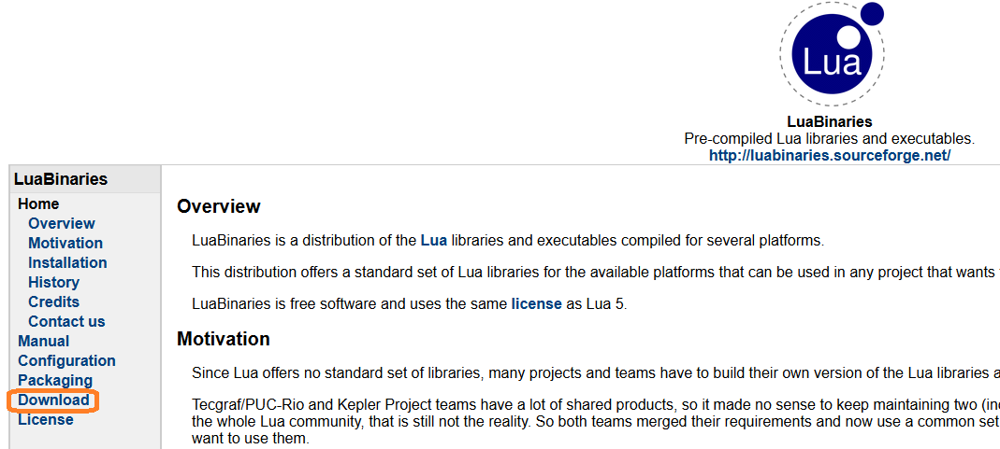
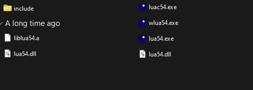
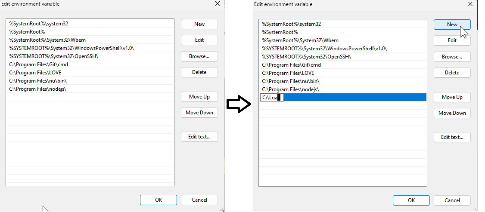
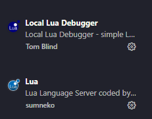
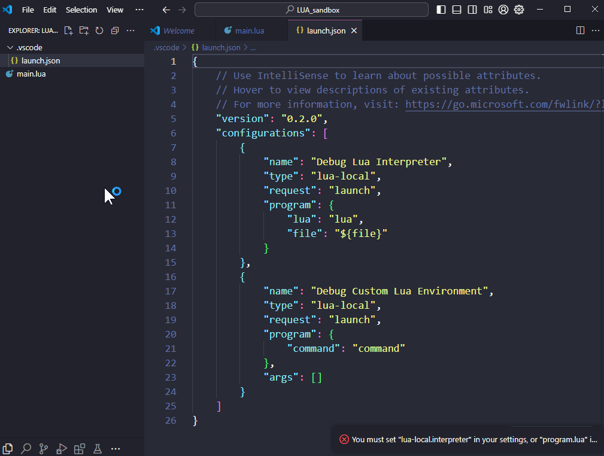
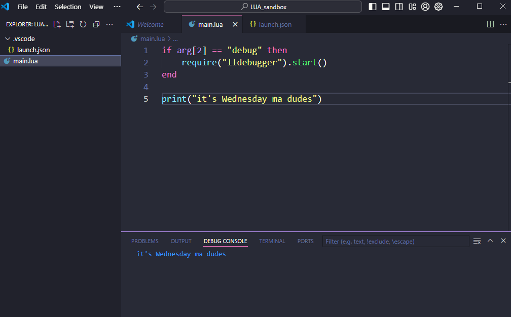

# Install LUA on Windows 11
This is a guide on how to setup LUA in Windows 11 and make a VSCODE setup
## Quick step
Steps between the ".---------------." can be skipped if you just click this link [Lua -> Download -> Binaries -> Download](https://luabinaries.sourceforge.net/download.html)

.------------------------------------------------------------------------------------------------------------------------.  
Follow **Quick step** to skip this:  

Go to [lua.org](https://lua.org)  

Click Download  


Click on Binaries  


Click on Download  

  
.------------------------------------------------------------------------------------------------------------------------. 

    
Click on Download:  

lua-5.4.2_Win64_bin.zip	Windows x64 Executables 

and

lua-5.4.2_Win64_dllw6_lib.zip	Windows x64 DLL and Includes
(MingW-w64 6 Built)  


This was the latest build as of 2024-06-20, so if newer are avalible i suggest you download those instead.  

Extract both folders  




Move content from one folder to the other  


Rename .exe files. They usually have version number added, we dont want that:
They could look like:  
wlua54.exe -> rename to -> wlua.exe  
luac54.exe -> rename to -> luac.exe  
lua65.exe -> rename to -> lua.exe  


Rename folder to lua  


Copy folder to c:/  

Like this -> c:/lua  


Go edit enviroment variables (press windows key search for env)  


Add the folder path to system variables path. (Select the one under system variables named path and press "edit" and then  "new")  




Press ok

Open powershell or cmd and write lua to see if you got it installed.


Now you successfully installed LUA on your windows machine.

If powershell writes the below then you didn't install it correctly. Then retry the steps and see where the error is :)  


# Setup LUA with VScode

Create a new project/folder and open that in vs code  

## Install extensions


## Set up debugging
Create a main.lua file and add the below and press save. The debug part is to activate the debug functionality provided by the Local Lua Debugger Extension.
```LUA
if arg[2] == "debug" then
    require("lldebugger").start()
end

print("it's Wednesday ma dudes")
```


## Setup launch.json for LUA
Then you press f5 when you have the main.lua file open, and then you will encounter an error: "You must set "lua-local.interpreter" in your settings....". Then VScode will generate a fodler names vscode with at launch.json file in



Then you replace the content of the file with this:

```JSON
{
    "version": "0.2.0",
    "configurations": [
      {
        "type": "lua-local",
        "request": "launch",
        "name": "Debug",
        "program": {
          "command": "C:/lua/lua.exe"
        },
        "args": [
          "main.lua}",
          "debug"
        ]
      },
      {
        "type": "lua-local",
        "request": "launch",
        "name": "Release",
        "program": {
          "command": "C:/lua/lua.exe"
        },
        "args": [
          "main.lua"
        ]
      }
    ]
  }
  
```

Now if you press f5 again you will se the print msg will print to the console. This setup run the main.lua file everytime you press f5.


If you want to simply run whatever file you are located in you can modify the args part so it looks like this 

```JSON
{
    "version": "0.2.0",
    "configurations": [
      {
        "type": "lua-local",
        "request": "launch",
        "name": "Debug",
        "program": {
          "command": "C:/lua/lua.exe"
        },
        "args": [
          "${file}",
          "debug"
        ]
      },
      {
        "type": "lua-local",
        "request": "launch",
        "name": "Release",
        "program": {
          "command": "C:/lua/lua.exe"
        },
        "args": [
          "${file}"
        ]
      }
    ]
  }
```

# LUA for game development
LUA is popular for making games, so if that's where you want to dive in then i recommend [LÖVE](https://love2d.org).

   

It's a really nice libary for making 2d games with LUA. I created a project: [inLOVE2d](https://github.com/sabelkat1/inLove2d) where you can find boilerplate code to get started with LÖVE and as well how to install and setup LÖVE on your Windows machine with VScode.    


### 

I made this guide since i struggled getting LUA setup on my machine the first time. Credit goes out to [Atoz Programming Tutorials](https://www.youtube.com/watch?v=pC1fsQRX68I) making my first LUA install a good experince :)

Feel free to make a pull request if you have anything nice to add ma dudes and dudeins :) 
